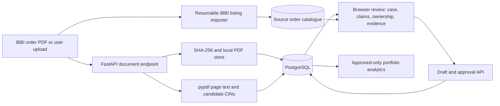

# IBC Evidence Explorer architecture

This is a local research system for Indian corporate insolvency cases. It has a resumable importer for the public IBBI NCLT order listing, stores linked PDFs, extracts page text, lets a researcher enter supported case facts, and includes approved records in summary analytics. Full historical backfill can take hours and is tracked through import status.

The API is in `backend/main.py`; input contracts and the haircut calculation are in `backend/models.py`. `backend/extraction.py` returns page text. `backend/db.py` creates PostgreSQL tables for cases, documents and audit events when `DATABASE_URL` is configured, with SQLite available for isolated tests. PostgreSQL stores the selected PDF's bytes in `documents.content`, alongside extraction and case data. `frontend/index.html`, `frontend/styles.css`, and `frontend/app.js` form a browser interface served by FastAPI. The OpenAPI reference is at `/docs`.

`backend/ibbi_orders.py` parses the public listing's 20-row pages and GET filters, saves order metadata and page checkpoints, and downloads order PDFs with retry and disk-space checks. Failed pages are recorded separately and retried on the next run. `source_orders`, `source_pages`, `source_page_failures`, `source_filters`, and `source_order_filters` are separate from the verified case tables. Source metadata is not automatically treated as a confirmed company, claim or outcome. The catalogue UI and `/api/orders` API provide search, date, remark, indexed-bench and tagged adverse filters, plus year and remark counts. Choosing an order creates a review draft from its PDF.

## Data rules

- A case can have several documents. Each populated case fact and each claim row must point to a document attached to that case and a page that exists.
- Uploaded PDFs yield text and unassigned candidate CINs. A candidate is not automatically the debtor CIN; the sample order contains the *buyer's* CIN on page 8.
- Amounts are stored in INR. `claimed`, `admitted`, `plan_amount` and `actual_paid` are distinct nullable fields. No value is inferred from a blank. The sample's category totals are marked as such; they are not party-wise claims.
- A plan haircut is calculated only for rows with both admitted claims and plan amounts, and only when admitted claims are greater than zero. Formula: `(matched admitted - matched plan) / matched admitted × 100`. It is a nominal plan comparison, not proof of actual recovery. The dashboard combines only approved resolution cases with matched rows, weighted by admitted amount. Liquidation outcomes are counted but excluded from this haircut.
- Duplicate documents are detected with SHA-256. Saving or adding a document resets a case to draft. Approval requires a reviewer name and explicit confirmation. The audit table records additions, edits and approvals.
- The current ownership lists are names with citations. Corporate identity reconciliation, shareholding percentages, effective dates and links between past and future owners need a richer data model in the next phase.

## API outline

| Method | Endpoint | Purpose |
|---|---|---|
| GET | `/api/sample` | Official sample metadata and source URL |
| POST | `/api/sample/import` | Import the bundled PDF and reviewed starter draft |
| POST | `/api/documents` | Upload PDF into a new or existing case |
| GET | `/api/cases` | Searchable list; `q` and `status` filters |
| GET | `/api/cases/{id}` | Case, documents, extracted pages, audit trail |
| PUT | `/api/cases/{id}` | Save review draft with optimistic version check |
| POST | `/api/cases/{id}/approve` | Approve a reviewed version |
| GET | `/api/analytics` | Approved-only counts and weighted plan haircut |

## Production path

After validating extraction on diverse orders, consider object storage for the PDFs while retaining PostgreSQL metadata and citations. Add an ingestion queue, OCR for scanned documents, document versioning, role-based access, reviewer attestations, and separate models for corporate entities, people, appointments and ownership periods. Build source-specific collectors only after confirming the terms and formats of each source. Later add entity matching with human review, since common names alone cannot establish ownership connections. Actual payment analytics require payment evidence beyond a resolution order.

## Source-to-field plan

| Source | Best initial use | Important limit |
|---|---|---|
| IBBI public announcements and orders | Case discovery, debtor, process, professional, outcomes | The page called “Resolution Plans” includes Form G invitations; it is not a complete register of approved plans or recoveries. |
| NCLT orders | Admission and decision dates, bench, plan approval or liquidation, amounts where stated | Orders differ in format; some omit creditor-level detail. |
| NCLAT orders | Appeals and later changes to a case outcome | Link each appeal to its underlying NCLT case; do not overwrite earlier decisions. |
| RP-published creditor lists | Party-wise filed and admitted claims | Availability varies by case; list date and revision must be recorded. |
| MCA21 master data and filings | CIN/DIN checks, directors, historical ownership evidence where filings support it | Present master data alone cannot establish who owned a company before and after resolution. Some documents may require login or payment. |

## Implemented normalized schema

`case_details`, `claims`, `people`, `plans`, `entities` and `import_jobs` are implemented alongside the existing evidence JSON and audit records. Startup creates these tables and backfills existing cases. Draft saves refresh their structured rows transactionally. Public URL imports run in a bounded background worker with persisted progress, retries, size limits and content deduplication. The screen displays professional averages, bench timelines and identifier-confirmed ownership overlaps. See [the implementation guide](url-import.md) for exact semantics and remaining limitations.

## Longer-term schema expansion

- `companies(id, cin, legal_name)` and `people(id, din, name)` are canonical entities. Names from orders are stored as aliases with their own evidence.
- `cases(id, debtor_company_id, case_number, bench, admission_date, current_outcome)` holds a process, not a document. An `events` table holds dated admissions, appointments, approvals, liquidations and appeals so history remains visible.
- `case_participants(case_id, entity_id, role, start_date, end_date, evidence_id)` records IRP, RP, liquidator, resolution applicant and creditor roles over time.
- `claims(case_id, creditor_entity_id, list_date, category, filed_inr, admitted_inr, scope, evidence_id)` keeps list versions and distinguishes individual claims from category totals.
- `plans(case_id, applicant_company_id, approval_date, plan_amount_inr, evidence_id)` and `plan_allocations(plan_id, claim_or_category_id, proposed_inr, actual_paid_inr, evidence_id)` distinguish an approved proposal from eventual payment.
- `ownership(company_id, owner_entity_id, effective_from, effective_to, share_pct, evidence_id)` and `directorships(company_id, person_id, start_date, end_date, evidence_id)` enable before/after comparisons without assuming that an approved plan was implemented.
- `documents` and `evidence(document_id, page, excerpt, extraction_method, reviewer)` trace each fact back to its source. Store extraction confidence as a review aid, never as legal certainty.

Entity matching prefers exact CIN/DIN. Similar names remain review suggestions with source identifiers, dates and context visible. An overlap flag is only an observation; it is not proof of wrongdoing. The current research panel defaults to the last 10 years of dated, approved cases and reports party-wise claim coverage, admitted-claim-weighted haircut, per-professional case links and missing evidence counts. A repeated 50%+ haircut flag needs at least two cases; it is not an attribution of who submitted a plan. IRP and RP roles are separate, and name matching without registration IDs is only provisional.

## Next POC milestone

Pick 10–20 cases across resolutions and liquidations. Build a source inventory with URL, case number, CIN, document type, date and access restrictions. Ingest admission and final orders plus available dated creditor lists. Add OCR for PDFs that fail text extraction. Check reviewed fields against original pages, reconcile professional name variants and report data coverage. A distributed durable queue, case merging and dated ownership history remain future extensions.
